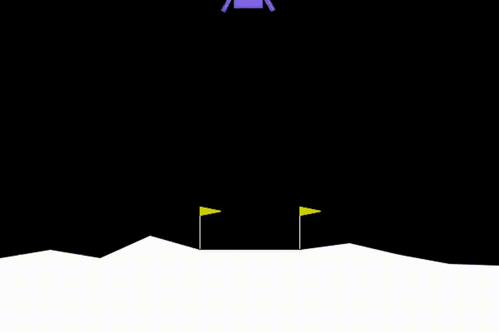

# Laboratory 2: Deep Reinforcement Learning

This repository contains the work for **Laboratory 2** of the **Deep Learning Applications** course, titled *"Deep Reinforcement Learning Laboratory"*.

## Contents

- The main code for this lab is provided in the Jupyter notebook:  
  [`DLA_Lab2_DRL.ipynb`](DLA_Lab2_DRL.ipynb)

- A detailed analysis of the experimental results is available in the W&B report:  
  [View W&B Report](https://api.wandb.ai/links/matteo-piras-universit-di-firenze/8rlg7q5c)

- The folders `DQL_CartPole_checkpoints` and `DQL_LunarLander_checkpoints` contain the checkpoints for the DQL models from exercise **3.2**.

## Video examples of environments solved using DQL

  

